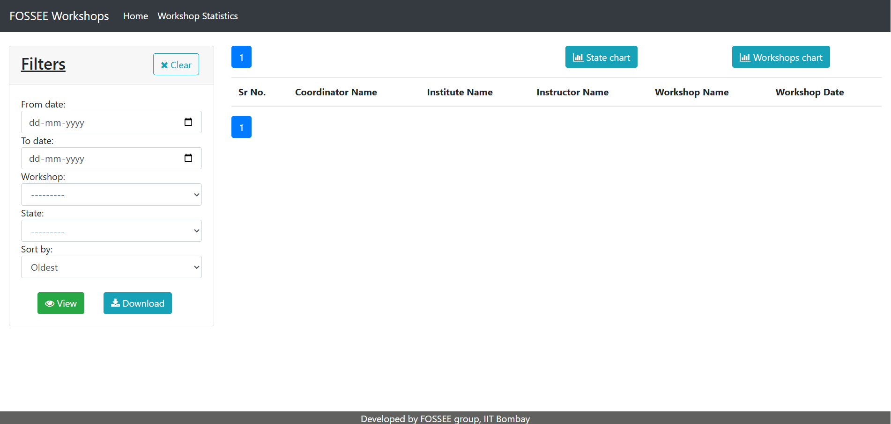
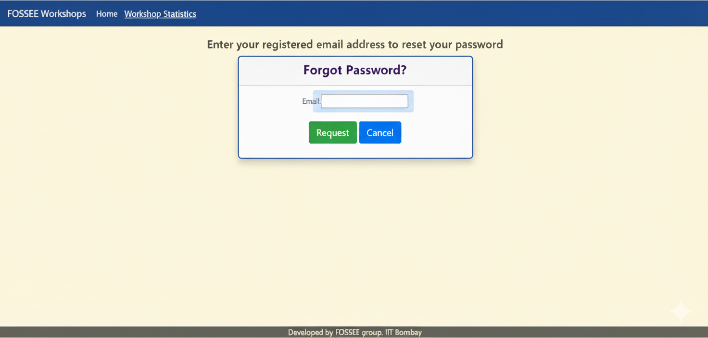

# **Workshop Booking**

> This website is for coordinators to book a workshop(s), they can book a workshop based on instructors posts or can propose a workshop date based on their convenience.

### Features
* Statistics
    1. Instructors Only
        * Monthly Workshop Count
        * Instructor/Coordinator Profile stats
        * Upcoming Workshops
        * View/Post comments on Coordinator's Profile
    2. Open to All
        * Workshops taken over Map of India
        * Pie chart based on Total Workshops taken to Type of Workshops.

* Workshop Related Features
    > Instructors can Accept, Reject or Delete workshops based on their preference, also they can postpone a workshop based on coordinators request.

__NOTE__: Check docs/Getting_Started.md for more info.

## Answers:
1. What design principles guided your improvements?
I focused on clarity, consistency, and user-friendliness. The goal was to make the interface intuitive and visually appealing without changing the existing functionality. I used clean layouts, readable fonts, balanced spacing, and subtle color contrasts to guide users naturally through the content. Every element was designed to reduce clutter and help users focus on the most important information.

2. How did you ensure responsiveness across devices?
I made sure the layout adapts smoothly to different screen sizes by using flexible containers, percentage-based widths, and CSS media queries. Navigation menus, tables, and cards were optimized to resize or stack appropriately on tablets and mobile devices. I continuously tested the pages on multiple screen resolutions to guarantee a seamless experience for desktop, tablet, and smartphone users.

3. What trade-offs did you make between the design and performance?
I prioritized simplicity and performance over heavy visual effects. Instead of adding large images or complex animations, I relied on lightweight CSS enhancements, subtle hover effects, and structured layouts. This ensures faster load times and a smoother experience, even on slower networks, while still improving the aesthetic appeal of the site.

4. What was the most challenging part of the task and how did you approach it?
The hardest part was making the interface modern and clean while keeping the original functionality untouched. Since I couldn’t change any backend logic, I had to carefully wrap existing elements with styled containers, adjust spacing, and improve readability without breaking templates or Django tags. I approached this by working incrementally: updating one component at a time, testing in the browser, and ensuring that all Django dynamic content rendered correctly before moving on to the next section.

Screenshots:
## before making changes

## After making changes 

## Setup Instructions

Follow these steps to run the workshop_booking project locally:

1. Install Python

Ensure Python 3.11 is installed .
Check your installation:

python --version

2. Clone the Repository
git clone https://github.com/FOSSEE/workshop_booking.git
cd workshop_booking

3. Create and Activate Virtual Environment

Windows:

python -m venv env
env\Scripts\activate

Mac/Linux:

python -m venv env
source env/bin/activate

4. Install Dependencies
pip install --upgrade pip
pip install -r requirements.txt

This installs Django, pandas, numpy, and other required libraries.

5. Set Up the Database
python manage.py migrate

This creates all necessary database tables. By default, the project uses SQLite.

6. Create a Superuser
python manage.py createsuperuser

Follow the prompts for username, email, and password.

This account allows access to the Django admin panel.

7. Collect Static Files
python manage.py collectstatic

This gathers all CSS, JS, and images used in templates.

8. Run the Development Server
python manage.py runserver

Open your browser and visit:

http://127.0.0.1:8000/